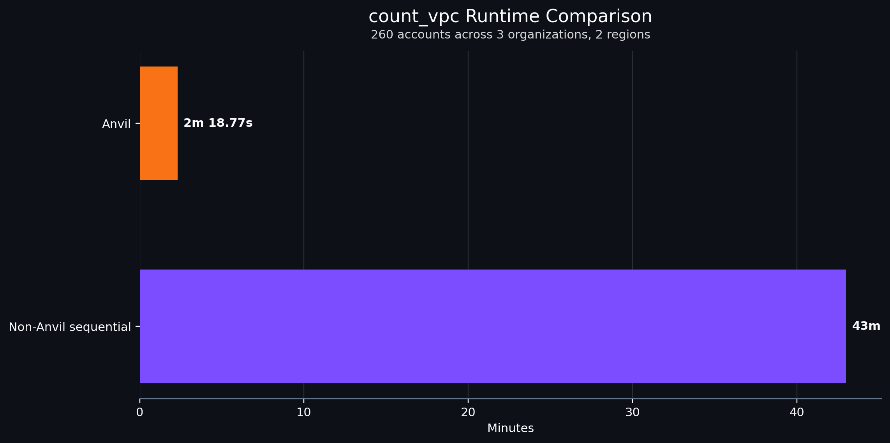

# anvil

<a name="readme-top"></a>

<!-- PROJECT SHIELDS -->
[![pytest][pytest-badge]][pytest-url]
[![ruff][ruff-badge]][ruff-url]
[![prek][prek-badge]][prek-url]


<!-- PROJECT LOGO -->
<br />
<div align="center">
    
  </a>

  <h3 align="center">README</h3>

  <p align="center">
    <a href="https://github.com/JSChronicles/anvil"><strong>Explore the docs »</strong></a>
    <br />
    <a href="https://github.com/JSChronicles/anvil/issues/new?labels=Bug%2CNeeds+Triage&projects=&template=bug.yaml&title=%5BBUG%5D+%3Ctitle%3E">Report Bug</a>
    ·
    <a href="https://github.com/JSChronicles/anvil/issues/new?labels=enhancement%2Cfeature+request&projects=&template=feature.yaml&title=%5BFEATURE%5D%3A+">Request Feature</a>
  </p>
</div>

## Introduction
Anvil is a declarative, multi-organization, multi-region AWS execution engine for running consistent, repeatable tasks across large numbers of AWS accounts, with explicit guarantees around ordering, isolation, and observability.

It provides a structured way to define what should run (tasks and dependencies) and where it should run (organizations, accounts, and regions), while the engine manages authentication, role assumption, bounded concurrency, fail-fast and cancellation behavior, and structured result aggregation across task, account, organization, and engine levels.

Anvil is intentionally task-agnostic. Tasks are implemented as simple Python modules with a defined runtime contract, allowing teams to build inventory, validation, enforcement, and reporting workflows without coupling business logic to the execution engine. Within an organization, account execution is parallelized through bounded worker pools, while dependency ordering and execution context are handled centrally by the engine.

At the YAML level, `max_parallel_targets` controls how many configured organization or account-group entries may execute at the same time within one config file. Per-target `max_workers` still controls account concurrency inside each target.

If you'd like to check out the flow or have a little more in-depth information about Anvil you can check out this [doc](docs/README.md)

### Standalone Multi-Account Script Template

If you do not need/want the full Anvil framework and only want a simple starting point for small AWS Organization tasks, see: [`templates/aws_multi_account_template.py`](./templates/multi_aws_account_task_template.py)

This template provides:
- AWS Organizations account discovery
- active-account filtering
- `--include` / `--exclude` account selection
- parallel per-account execution
  - multiple regions per account
- assume-role handling for member accounts
- dry-run support
- JSON result output

Replace the innards of the `account_task()` function with your own per-account logic.
Replace the `--example-piece` argparse and `example_piece` in other areas or edit as desired

## Example Benchmarks
To measure concurrency behavior, Anvil was tested across 3 organizations with a combined 260 accounts.

`max_parallel_targets` controls how many organizations or account groups run at the same time, depending on the config type. `max_workers` controls how many accounts run in parallel inside each organization or account group.

<p align="left">
  
</p>


## Usage
1. When using the uv tool, there are several ways to run and install dependencies. Here are a few examples:
   1. Manual setup (similar to pip-tools):
      1. Create a Python virtual environment: uv venv or python -m venv .venv
      1. Activate the virtual environment: .\.venv\Scripts\activate.ps1
      1. Install dependencies: uv pip install --requirements pyproject.toml
1. uv sync:
   1. Sync the project's dependencies with the environment: uv sync
   1. Activate the virtual environment: .venv\Scripts\activate
1. uv run:
   1. Run a command in the project environment.: uv run example.py <args>
   1. Note that if you use uv run in a project, i.e. a directory with a pyproject.toml, it will install the current project before running the script.


There are multiple global commands
```console
anvil auth …
anvil graph …
anvil tasks …
anvil run …
```

### Logging verbosity

The `run`, `auth check`, and `graph` commands support `--log-level` to control console output verbosity.

Supported values:
- `DEBUG`
- `INFO`
- `WARNING`
- `ERROR`
- `CRITICAL`

Examples:

```console
anvil run --config-file ./yaml/orgs.yaml --log-level ERROR
anvil auth check --config-file ./yaml/orgs.yaml --log-level WARNING
anvil graph --config-file ./yaml/orgs.yaml --log-level INFO
```

### Authentication

Authentication checks validate AWS credentials and access without executing any tasks.

```console
anvil auth check --help
```

Authenticate credentials from an organization file.
```console
anvil auth check --config-file ./yaml/orgs.yaml

INFO     [auth.py:auth_check:106] Running auth check for org=root profile=root auth_source=AuthSource.SSO
INFO     [auth.py:auth_check:106] Running auth check for org=other-root profile=other-root auth_source=AuthSource.SSO
INFO     [auth.py:auth_check:106] Running auth check for org=random-root profile=random-root auth_source=AuthSource.UNKNOWN
WARNING  [credentials.py:_protected_refresh:603] Refreshing temporary credentials failed during mandatory refresh period.
botocore.exceptions.UnauthorizedSSOTokenError: The SSO session associated with this profile has expired or is otherwise invalid. To refresh this SSO session run aws sso login with the corresponding profile.
{
  "generated_at": "2026-03-31T15:30:15.075014+00:00",
  "auth": [
    {
      "org_name": "root",
      "status": "error",
      "source": "sso",
      "started_at": "2026-03-31T15:30:14.836545+00:00",
      "ended_at": "2026-03-31T15:30:15.074440+00:00",
      "duration_seconds": 0.23789780004881322,
      "message": "AWS SSO session is invalid or expired.",
      "remediation": "aws sso login --profile root"
    },
    {
      "org_name": "other-root",
      "status": "error",
      "source": "sso",
      "started_at": "2026-03-31T15:30:14.841167+00:00",
      "ended_at": "2026-03-31T15:30:15.072661+00:00",
      "duration_seconds": 0.23149509984068573,
      "message": "AWS SSO session is invalid or expired.",
      "remediation": "aws sso login --profile other-root"
    },
    {
      "org_name": "random-root",
      "status": "error",
      "source": "unknown",
      "started_at": "2026-03-31T15:30:14.849622+00:00",
      "ended_at": "2026-03-31T15:30:14.904089+00:00",
      "duration_seconds": 0.054468399845063686,
      "message": "AWS profile not found.",
      "remediation": "Fix your AWS profile configuration."
    }
  ]
}


INFO [auth.py:auth_check:106] Running auth check for org=root profile=root auth_source=AuthSource.SSO
{
  "generated_at": "2026-03-31T15:34:56.998631+00:00",
  "auth": [
    {
      "org_name": "root",
      "status": "success",
      "source": "sso",
      "started_at": "2026-03-31T15:34:54.844004+00:00",
      "ended_at": "2026-03-31T15:34:56.971776+00:00",
      "duration_seconds": 2.1277707000263035,
      "message": "Authenticated successfully.",
      "remediation": null
    },
    {
      "org_name": "other-root",
      "status": "success",
      "source": "sso",
      "started_at": "2026-03-31T15:34:54.848072+00:00",
      "ended_at": "2026-03-31T15:34:56.998306+00:00",
      "duration_seconds": 2.1502324000466615,
      "message": "Authenticated successfully.",
      "remediation": null
    }
  ]
}
```

Suppress all output and rely on the exit code only (useful for CI)
```console
anvil auth check --config-file orgs.yaml --quiet
INFO     [auth.py:auth_check:106] Running auth check for org=root profile=root auth_source=AuthSource.SSO
```

### Graph
Display the resolved task dependency graph for an organization configuration.

```console
anvil graph --help
```

Generate a dependency graph from an organization file.
```console
anvil graph --config-file .\examples\07-optional-task-semantics.yaml

Execution Graph (optional-semantics-org)
----------------------------------------
inventory
└──     reporting
    └──         cleanup
```

Output graph results as JSON
```console
anvil graph --config-file .\examples\07-optional-task-semantics.yaml --json

{
  "organization": "optional-semantics-org",
  "tasks": [
    {
      "name": "inventory",
      "depends_on": []
    },
    {
      "name": "reporting",
      "depends_on": [
        "inventory"
      ]
    },
    {
      "name": "cleanup",
      "depends_on": [
        "reporting"
      ]
    }
  ]
}
```


### Task Management
List all available stock and user-defined tasks
```console
anvil tasks list

Available tasks:
plugin: my-test-project:
  - hello
  - test

stock:
  - compare_asg_to_cluster_instances
  - get_aws_inline_policies
  - get_organization_structure
  - noop
  - noop_fail
  - remove_iam_user
  - remove_missing_group_assignments
  ...
```

Validate all available stock and user-defined tasks:
```console
anvil tasks validate
[ERROR] task validation failed:
  - task 'cleanup' is missing required run() parameters: ['account_alias']
  - task 'inventory' is missing required run() parameters: ['metadata']
```

### Execution
```console
anvil run --help
```

Execute all configured organizations and accounts from one or more YAML files, write per-target full results to `./results/{target-name}.json`, and produce one summary file per YAML using the config filename stem.
```console
anvil run --config-file ./yaml/noop.yaml
INFO     [auth.py:auth_check:106] Running auth check for org=root profile=root auth_source=AuthSource.SSO
INFO     [organization.py:execute:39] Starting organization processing (org=root, region=us-east-1)
INFO     [account.py:execute:48] Processing account root (123456789000)
INFO     [account.py:execute:48] Processing account account1 (111111111111)
INFO     [account.py:execute:48] Processing account account2 (222222222222)
INFO     [noop.py:run:33] No-op task executed for account root (123456789000), dry_run=False
INFO     [account.py:execute:48] Processing account Log Archive (333333333333)
INFO     [account.py:execute:48] Processing account Audit (444444444444)
INFO     [noop.py:run:33] No-op task executed for account account1 (111111111111), dry_run=False
INFO     [noop.py:run:33] No-op task executed for account Audit (444444444444), dry_run=False
INFO     [noop.py:run:33] No-op task executed for account Log Archive (333333333333), dry_run=False
INFO     [noop.py:run:33] No-op task executed for account account2 (222222222222), dry_run=False
......
INFO     [cli.py:_write_run_results:90] Wrote summary to xxxx\xxxx\results\noop-target-summary.json and 1 target result files

#Summary below
{
  "state": "completed_success",
  "generated_at": "2026-03-17T18:48:47.392583+00:00",
  "auth": [
    {
      "org_name": "root",
      "status": "success",
      "source": "sso",
      "started_at": "2026-03-17T18:48:36.615369+00:00",
      "ended_at": "2026-03-17T18:48:38.338430+00:00",
      "duration_seconds": 1.7230594999855384,
      "message": "Authenticated successfully.",
      "remediation": null
    }
  ],
  "organizations": [
    {
      "organization": "root",
      "total_accounts": 50,
      "failed_accounts": 0,
      "interrupted_accounts": 0,
      "failed_tasks": 0,
      "has_failures": false,
      "error": null
    }
  ],
  "total_failed_accounts": 0,
  "total_interrupted_accounts": 0,
  "total_failed_tasks": 0
}
```

To run multiple YAML files in one command, pass them after a single `--config-file` flag. They run sequentially in the order provided. Each YAML remains an isolated run with its own summary file, and the overall command exits non-zero if any YAML run fails.
```console
anvil run --config-file ./yaml/orgs.yaml ./yaml/orgs2.yaml ./yaml/orgs3.yaml
```

Within a single YAML, you can bound how many configured targets run in parallel. This is separate from each target's `max_workers` setting:
```yaml
schema_version: 1
max_parallel_targets: 4
organizations:
  - name: root
    max_workers: 10
```

You can run `--include`, `--exclude`, or `--dry-run` to override the YAML file if you want to just test something or run on certain accounts.
```console
# Include only specific accounts:
anvil run --config-file orgs.yaml --include 111111111111 222222222222

# Exclude specific accounts:
anvil run --config-file orgs.yaml --exclude 333333333333 444444444444

# Exclude specific accounts and perform a dry-run:
anvil run --config-file orgs.yaml --exclude 333333333333 444444444444 --dry-run
```


## Custom Tasks (Project-Local)

Anvil supports **project-local tasks** in addition to its stock tasks. This allows you to add custom behavior without forking Anvil.

### How task discovery works

Tasks are resolved in the following order:

Anvil discovers tasks from two sources:

- Stock tasks - tasks shipped with Anvil (anvil.tasks)

- Plugin tasks - tasks registered via the anvil.tasks entry-point group

Directories named `tasks/` are conventional only and are not automatically scanned.


### Create a project-local tasks directory
These set of steps is because I'm waiting on pypi for a certain issue.

Create a directory anywhere in your project:

```text
my-project/
├─ tasks/
│  ├─ inventory.py
│  ├─ cleanup.py
│  └─ tagging.py
```
Each task module must define a callable run() function.

### Register tasks in your project’s pyproject.toml using entry points
```ini
[project.entry-points."anvil.tasks"]
project = "tasks"
```

Note you may need to do these steps to activate your test project and anvil into the same venv
1. Setup your virtual environment
   1. `uv venv`
1. From your test project root, install Anvil into that environment too.
   1. `uv pip install -e path\to\anvil\`
1. Then also install your plugin project into the same env:
   1. `uv pip install -e .`
1. You should see some path output via `uv run python -c "import anvil; print(anvil.__file__)"`


### Implement the Task Contract

Each task module must define a callable `run` function.
This is the minimum interface required for Anvil to discover and execute a task.

```python
def run(
    *,
    account_id: str,
    account_alias: str,
    session,
    dry_run: bool,
    metadata: dict,
    actions=None,
):
    """
    Execute the task for a single AWS account.
    """
```

#### Arguments

- `account_id` - AWS account ID currently being processed.
- `account_alias` - Friendly name of the account.
- `session` - A boto3 Session already scoped to the target account.
- `dry_run` - Indicates whether the task should make changes.
- `metadata` - Organization metadata defined in the configuration file.

The return value is optional. Any returned data may be included in execution results.

---

### Optional Helpers (Advanced Usage)

While only the `run()` function is required, tasks can optionally use Anvil-provided utilities to produce structured results or record actions.

For example, tasks may import helpers such as:

```python
from anvil.task_definition import ActionRecorder
```

This helper allow tasks to:

- record planned or executed actions
- produce structured output for reporting
- integrate with Anvil’s execution summaries

You can view examples of this here [ActionRecorder](./examples/ActionRecorder/README.md)

Using these utilities is **not required**, but recommended for tasks that modify infrastructure or need richer audit output.

### Reference tasks in YAML
Once configured, custom tasks behave exactly like stock tasks:

```yaml
tasks:
  - name: inventory
  - name: cleanup
    depends_on: [inventory]
```


<!-- MARKDOWN LINKS & IMAGES -->
[pytest-badge]:https://github.com/JSChronicles/anvil/actions/workflows/pytest.yaml/badge.svg?branch=main
[pytest-url]:https://github.com/JSChronicles/anvil/actions/workflows/pytest.yaml
[ruff-badge]:https://github.com/JSChronicles/anvil/actions/workflows/ruff.yaml/badge.svg?branch=main
[ruff-url]:https://github.com/JSChronicles/anvil/actions/workflows/ruff.yaml

[prek-badge]:https://img.shields.io/endpoint?url=https://raw.githubusercontent.com/j178/prek/master/docs/assets/badge-v0.json
[prek-url]:https://github.com/j178/prek
