# anvil in-depth

<a name="readme-top"></a>

<!-- PROJECT LOGO -->
<br />
<div align="center">
    
  </a>

  <h3 align="center">README</h3>

  <p align="center">
    <a href="https://github.com/JSChronicles/anvil"><strong>Explore the docs</strong></a>
    <br />
    <a href="https://github.com/JSChronicles/anvil/issues/new?labels=Bug%2CNeeds+Triage&projects=&template=bug.yaml&title=%5BBUG%5D+%3Ctitle%3E">Report Bug</a>
    &middot;
    <a href="https://github.com/JSChronicles/anvil/issues/new?labels=enhancement%2Cfeature+request&projects=&template=feature.yaml&title=%5BFEATURE%5D%3A+">Request Feature</a>
  </p>
</div>

## Table of contents

- [Execution model](#execution-model)
- [Flow](#flow)
- [Authentication validation](#authentication-validation)
- [Detailed CLI examples](#detailed-cli-examples)
- [Result queries](#result-queries)
- [Task validation](#task-validation)
- [Task discovery and authoring](#task-discovery-and-authoring)
- [CLI shape](#cli-shape)

## Execution model

Anvil executes declarative task workflows across one or more AWS organizations, across many accounts within each organization, and across one or more configured AWS regions.

At a high level:

1. Each organization is defined independently in configuration.
1. Each organization can declare its own profile, role, regions, worker limits, region concurrency, task graph, include or exclude filters, dry-run behavior, and fail-fast behavior.
1. Each YAML can optionally declare `max_parallel_targets` to bound how many configured targets are allowed to execute at once.
1. Anvil validates the YAML against the packaged JSON Schema and semantic target rules before execution starts.
1. For each organization, Anvil authenticates, creates an organization-scoped base session, discovers eligible accounts, discovers region statuses, validates configured regions against enabled regions, and builds the effective account execution set.
   1. Selected accounts execute in parallel within that organization, bounded by the configured worker limit.
1. Within an account, tasks execute in dependency order for each effective configured region, with optional bounded region concurrency.
1. Results are captured at task, account, organization, and engine scope.

This makes Anvil suitable for workflows that need consistent execution across multiple AWS organizations while still respecting account boundaries, region-specific service presence, and per-organization execution settings.

## Flow

```mermaid
flowchart TD
    A["Run command"] --> B["Load YAML"]
    B --> C["Start target pipeline"]

    C --> D["Prepare targets in parallel<br/>bounded by<br/>max parallel targets"]
    D --> E{"Target prepared"}
    E --> F["Auth check"]
    F --> G{"Auth OK?"}

    G -->|No| H["Record auth result<br/>skip execution"]
    G -->|Yes| I["Apply run-time overrides"]
    I --> J["Resolve task graph"]
    J --> K["Build execution context"]
    K --> L["Ready queue"]

    L --> M{"Execution slot open<br/>and org not already active?"}
    M -->|No| N["Wait in ready queue"]
    M -->|Yes| O{"Target type?"}

    O -->|Organization| P1
    O -->|Accounts| Q1

    subgraph LEFT["Organization target"]
        direction TD
        P1["Create base session"]
        P1 --> P2["Read org identity"]
        P2 --> P3["Discover active accounts"]
        P3 --> P4["Discover region statuses"]
        P4 --> P5["Validate configured regions"]
        P5 --> P6["Apply include/exclude filters"]
        P6 --> P7["Build account list"]
    end

    subgraph RIGHT["Explicit accounts target"]
        direction TD
        Q1["Create base session"]
        Q1 --> Q2["Read explicit account list"]
        Q2 --> Q3["Build account list"]
    end

    P7 --> R["Create account worker pool"]
    Q3 --> R

    R --> S["Dispatch accounts in parallel<br/>bounded by per-target max workers"]
    S --> T["Worker executes one account"]

    T --> U{"Management account?"}
    U -->|Yes| V["Reuse worker session<br/>for region"]
    U -->|No| W["Assume role once<br/>for account"]
    W --> X["Create region session<br/>from assumed credentials"]

    V --> C1["Wrap account-region session<br/>with lazy client cache"]
    X --> C1
    C1 --> Y["Run tasks by region<br/>in dependency order"]

    Y --> YA{"More tasks or regions?"}
    YA -->|Yes| Y
    YA -->|No| Z{"Failure with fail-fast?"}

    Z -->|No| AA["Continue account work"]
    Z -->|Yes| AB["Set cancellation signal"]
    AB --> AC["Stop pending account work"]

    AA --> AD["Account result"]
    AC --> AD

    AD --> AE["Target result"]
    AE --> AF["Release org slot if needed"]
    AF --> AG["Record target result<br/>in input order"]

    H --> AH{"More prep or<br/>execution work?"}
    N --> AH
    AG --> AH
    AH -->|Yes| E
    AH -->|No| AI["Build ordered auth results"]
    AI --> AJ["Build ordered target results"]
    AJ --> AK["Compute engine state"]
    AK --> AL["Return engine result"]
```



## Authentication validation

Anvil includes an authentication check mode that validates AWS access for each configured organization before account-level task execution begins. This helps catch expired credentials, missing profiles, access issues, or invalid SSO sessions early.

- Authentication checks run concurrently across organizations through a small bounded worker pool. Anvil currently validates up to **4 organizations at a time**, which reduces startup latency while keeping concurrency controlled.

- Within one run, Anvil reuses auth-check outcomes for targets that use the same profile and inferred authentication source. The first target performs the STS identity check, while concurrent or later targets with the same auth identity reuse that outcome. Output remains target-specific: each target still receives its own `AuthResult`, and a cached failure is reported for every target that uses the failing identity.

### What authentication validation does

For each configured organization, Anvil:

1. Infers the likely authentication source.
2. Creates a boto3 session.
3. Calls AWS STS `GetCallerIdentity`.
4. Records a structured result with status, source, timing, message, and optional remediation guidance.

Authentication validation is a lightweight preflight validation step, not a full execution run.

### Supported authentication-source detection

Anvil can currently classify authentication as:

- **SSO**
- **Profile static**
- **Profile assume role**
- **Environment**
- **OIDC**
- **Unknown**

This source classification is informational, but it improves failure reporting and remediation guidance.

### Common checks and error meanings

Auth check normalizes several common authentication problems into clearer messages, including:

- **AWS profile not found**
- **No AWS credentials available**
- **AWS SSO session is invalid or expired**
- **AWS credentials have expired**
- **Access denied when calling AWS**
- **Unexpected error during authentication**

Where possible, Anvil also includes remediation guidance such as re-running SSO login for the affected profile.

### Authentication commands

Authentication checks validate AWS credentials and access without executing any tasks.

```console
anvil validate --help
```

Authenticate credentials from an organization file:

```console
anvil validate --auth --config-file ./yaml/orgs.yaml
```

Suppress validation output and rely on the exit code only, which is useful for CI:

```console
anvil validate --tasks --processors --auth --config-file orgs.yaml --quiet
```

## Detailed CLI examples

### Authentication output

Authenticate credentials from an organization file:

```console
anvil validate --auth --config-file ./yaml/orgs.yaml

INFO     [auth.py:auth_check:106] Running auth check for org=root profile=root auth_source=AuthSource.SSO
INFO     [auth.py:auth_check:106] Running auth check for org=other-root profile=other-root auth_source=AuthSource.SSO
INFO     [auth.py:auth_check:106] Running auth check for org=random-root profile=random-root auth_source=AuthSource.UNKNOWN
WARNING  [credentials.py:_protected_refresh:603] Refreshing temporary credentials failed during mandatory refresh period.
botocore.exceptions.UnauthorizedSSOTokenError: The SSO session associated with this profile has expired or is otherwise invalid. To refresh this SSO session run aws sso login with the corresponding profile.
{
  "generated_at": "2026-03-31T15:30:15.075014+00:00",
  "auth": [
    {
      "org_name": "root",
      "status": "error",
      "source": "sso",
      "started_at": "2026-03-31T15:30:14.836545+00:00",
      "ended_at": "2026-03-31T15:30:15.074440+00:00",
      "duration_seconds": 0.23789780004881322,
      "message": "AWS SSO session is invalid or expired.",
      "remediation": "aws sso login --profile root"
    },
    {
      "org_name": "other-root",
      "status": "error",
      "source": "sso",
      "started_at": "2026-03-31T15:30:14.841167+00:00",
      "ended_at": "2026-03-31T15:30:15.072661+00:00",
      "duration_seconds": 0.23149509984068573,
      "message": "AWS SSO session is invalid or expired.",
      "remediation": "aws sso login --profile other-root"
    },
    {
      "org_name": "random-root",
      "status": "error",
      "source": "unknown",
      "started_at": "2026-03-31T15:30:14.849622+00:00",
      "ended_at": "2026-03-31T15:30:14.904089+00:00",
      "duration_seconds": 0.054468399845063686,
      "message": "AWS profile not found.",
      "remediation": "Fix your AWS profile configuration."
    }
  ]
}
```

A successful authentication check returns success records for each configured target:

```console
INFO [auth.py:auth_check:106] Running auth check for org=root profile=root auth_source=AuthSource.SSO
{
  "generated_at": "2026-03-31T15:34:56.998631+00:00",
  "auth": [
    {
      "org_name": "root",
      "status": "success",
      "source": "sso",
      "started_at": "2026-03-31T15:34:54.844004+00:00",
      "ended_at": "2026-03-31T15:34:56.971776+00:00",
      "duration_seconds": 2.1277707000263035,
      "message": "Authenticated successfully.",
      "remediation": null
    },
    {
      "org_name": "other-root",
      "status": "success",
      "source": "sso",
      "started_at": "2026-03-31T15:34:54.848072+00:00",
      "ended_at": "2026-03-31T15:34:56.998306+00:00",
      "duration_seconds": 2.1502324000466615,
      "message": "Authenticated successfully.",
      "remediation": null
    }
  ]
}
```

### Graph output

Display the resolved task dependency graph for an organization configuration:

```console
anvil graph --help
```

Generate a dependency graph from an organization file:

```console
anvil graph --config-file .\examples\07-optional-task-semantics.yaml

Execution Graph (optional-semantics-org)
----------------------------------------
inventory
`-- reporting
    `-- cleanup
```

Output graph results as JSON:

```console
anvil graph --config-file .\examples\07-optional-task-semantics.yaml --json

{
  "organization": "optional-semantics-org",
  "tasks": [
    {
      "name": "inventory",
      "depends_on": []
    },
    {
      "name": "reporting",
      "depends_on": [
        "inventory"
      ]
    },
    {
      "name": "cleanup",
      "depends_on": [
        "reporting"
      ]
    }
  ]
}
```

### Run output and result layout

Execute all configured organizations and accounts from one or more YAML files:

```console
anvil run --help
```

Run a single YAML file:

```console
anvil run --config-file ./yaml/orgs.yaml
```

To run multiple YAML files in one command, pass them after a single `--config-file` flag. They run sequentially in the order provided. Each YAML remains an isolated run with its own summary file, and the overall command exits non-zero if any YAML run fails.

```console
anvil run --config-file ./yaml/orgs.yaml ./yaml/orgs2.yaml ./yaml/orgs3.yaml
```

Organization configs write per-target result files under `organizations/`:

```text
results/
  <config-stem>/
    <run-id>/
      summary.json
      results.jsonl
      organizations/
        <organization>.json
```

Account-group configs use `account-groups/` for per-target JSON files instead of `organizations/`:

```text
results/
  <config-stem>/
    <run-id>/
      summary.json
      results.jsonl
      account-groups/
        <account-group>.json
```

Example run output:

```console
anvil run --config-file ./yaml/noop.yaml
INFO     [auth.py:auth_check:106] Running auth check for org=root profile=root auth_source=AuthSource.SSO
INFO     [organization.py:execute:39] Starting organization processing (org=root, region=us-east-1)
INFO     [account.py:execute:48] Processing account root (123456789000)
INFO     [account.py:execute:48] Processing account account1 (111111111111)
INFO     [account.py:execute:48] Processing account account2 (222222222222)
INFO     [noop.py:run:33] No-op task executed for account root (123456789000), dry_run=False
INFO     [account.py:execute:48] Processing account Log Archive (333333333333)
INFO     [account.py:execute:48] Processing account Audit (444444444444)
INFO     [noop.py:run:33] No-op task executed for account account1 (111111111111), dry_run=False
INFO     [noop.py:run:33] No-op task executed for account Audit (444444444444), dry_run=False
INFO     [noop.py:run:33] No-op task executed for account Log Archive (333333333333), dry_run=False
INFO     [noop.py:run:33] No-op task executed for account account2 (222222222222), dry_run=False
......
INFO     [cli.py:_write_run_results:132] Wrote run results to xxxx\xxxx\results\noop\2026-05-01T183012Z

```

## Result queries

Runs still write the existing full JSON result files. They also write JSONL records that flatten account and task results for quick filtering:
`./results/{config-stem}/{run-id}/results.jsonl`.

### Common result queries

```console
# Show every failure under ./results.
anvil results --status failed

# Query one explicit run results file.
anvil results --status failed --results-file ./results/orgs/2026-05-01T183012Z/results.jsonl

# Query multiple explicit run results files in one command.
anvil results --status failed --results-file ./results/orgs/run-a/results.jsonl ./results/accounts/run-b/results.jsonl

# Show failures for one organization or account-group target.
anvil results --target prod --status failed

# Show failed account records only.
anvil results --type account --status failed

# Filter records for one account by AWS account ID or friendly account name.
anvil results --account 111111111111
anvil results --account dev

# Combine account filtering with other result filters.
anvil results --account dev --status failed
anvil results --account 111111111111 --type task --task count_vpcs

# Show task records for one task name.
anvil results --type task --task count_vpcs

# Show task records for one AWS region.
anvil results --type task --region us-east-1

# Show a compact failure view with selected fields and a row limit.
anvil results --status failed --fields account_id,region,task,error --limit 20

# Emit failed task records as JSONL.
anvil results --type task --status failed --jsonl
```

### Rerun failures

> [!NOTE]
> `--rerun` infers the rerun scope from result records. It reloads the original config, reruns only matching failed accounts, narrows to failed regions and tasks when task-level failures are available, and includes required task dependencies automatically.
> Use scope filters such as `--target`, `--account`, `--region`, and `--task` to limit a rerun even further. Report-shaping flags such as `--type`, `--fields`, `--limit`, `--json`, and `--jsonl` are not supported with `--rerun`.

```console
# Rerun failures from one explicit run results file.
anvil results --status failed --results-file ./results/orgs/2026-05-01T183012Z/results.jsonl --rerun

# Rerun failures from multiple explicit run results files in one command.
anvil results --status failed --results-file ./results/orgs/run-a/results.jsonl ./results/accounts/run-b/results.jsonl --rerun
```

The result query command supports `--type`, `--target`, `--account`,
`--region`, `--task`, `--status`, `--fields`, `--limit`, `--results-file` with
one or more JSONL paths, and `--json` or `--jsonl` for structured filtered
output. `--status failed` matches any non-success status. Without
`--results-file`, Anvil queries every `results.jsonl` file under `./results`.

## Task validation

Anvil includes a task validation mode that checks discovered tasks for structural correctness without executing them. This helps catch task-definition issues before a run begins.

### Task management commands

List all available stock and user-defined tasks:

```console
anvil tasks list

Available tasks:
plugin: my-test-project:
  - hello
  - test

stock:
  - compare_asg_to_cluster_instances
  - get_aws_inline_policies
  - get_organization_structure
  - noop
  - noop_fail
  - remove_iam_user
  - remove_missing_group_assignments
  ...
```

Validate all available stock and user-defined tasks:

```console
anvil validate --tasks
[ERROR]  Tasks
         task 'cleanup' is missing required run() parameters: ['account_alias']
         task 'inventory' is missing required run() parameters: ['metadata']

Result: Failed
```

```console
anvil validate --tasks
[OK]     Tasks

Result: Success
```

Validate selected tasks by name:

```console
anvil validate --tasks count_vpc noop
```

Validate discovered processors:

```console
anvil validate --processors
```

Validate selected processors by name:

```console
anvil validate --processors summary_report html_export
```

### What task validation does

Task validation verifies:

1. the task has a valid non-empty name
2. the task exposes a callable `run(...)` entrypoint
3. the `run(...)` signature includes the structurally required runtime parameters
4. the task does not use unsupported positional-only parameters
5. duplicate task names are rejected

Because this validation is structural, it does not perform AWS calls or execute task logic.

### Runtime contract expectations

Tasks are expected to expose a `run(...)` function compatible with the engine-managed execution contract.

Structural validation currently requires support for these parameters:

- `account_id`
- `account_alias`
- `session`
- `dry_run`
- `metadata`
- `actions`

The `actions` parameter receives an action recorder that tasks can use to record meaningful work performed during execution.

### Dependency-aware execution

Tasks execute in dependency order within each account-region pair.

- If a task depends on a failed earlier dependency, Anvil records that task as blocked by dependency failure. Optional tasks can be skipped after dependency failure without failing the entire account, while non-optional task failures stop further execution for that region.

## Task discovery and authoring

### How task discovery works

Tasks are resolved in the following order:

Anvil discovers tasks from two sources:

- Stock tasks - tasks shipped with Anvil (`anvil.tasks`)
- Plugin tasks - tasks registered via the `anvil.tasks` entry-point group

Directories named `tasks/` are conventional only and are not automatically scanned.

### Reference tasks in YAML

Once configured, custom tasks behave exactly like stock tasks:

```yaml
tasks:
  - name: inventory
  - name: cleanup
    depends_on: [inventory]
```

### Implement the task contract

Each task module must define a callable `run` function. This is the minimum interface required for Anvil to discover and execute a task.

```python
from anvil.actions import ActionRecorder

def run(
    *,
    account_id: str,
    account_alias: str,
    session,
    dry_run: bool,
    metadata: dict[str, object],
    actions: ActionRecorder,
) -> None:
    """
    Execute the task for one AWS account-region pair.
    """
```

#### Arguments

- `account_id` - AWS account ID currently being processed.
- `account_alias` - Friendly name of the account.
- `session` - A boto3 Session already scoped to the target account and region.
- `dry_run` - Indicates whether the task should make changes.
- `metadata` - Organization metadata defined in the configuration file.
- `actions` - Action recorder provided by Anvil for planned or completed work.

The return value is optional. Any returned data may be included in execution results.

### Optional helpers

Tasks can use Anvil-provided utilities to produce structured results. `ActionRecorder` allows tasks to:

- record planned or executed actions
- produce structured output for reporting
- integrate with Anvil's execution summaries

You can view returned-result and ActionRecorder examples in [Results](../examples/Results/README.md).

Using these utilities is **not required**, but recommended for tasks that modify infrastructure or need richer audit output.

## CLI shape

Anvil currently exposes these primary command groups:

- `run`
- `tasks list`
- `processors list`
- `validate`
- `graph`
- `results`

Configured targets can also be narrowed at invocation time with `--include`. Organization configs additionally support `--exclude` to remove discovered account IDs from the execution set.
