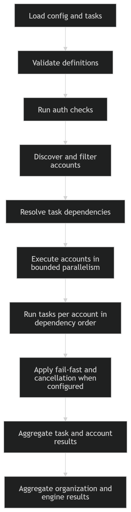

# anvil in-depth

<!-- PROJECT LOGO -->
 

    
  </a>

  <h3 align="center">README</h3>

  

    <a href="https://github.com/JSChronicles/anvil"><strong>Explore the docs »</strong></a>
     
    <a href="https://github.com/JSChronicles/anvil/issues/new?labels=Bug%2CNeeds+Triage&projects=&template=bug.yaml&title=%5BBUG%5D+%3Ctitle%3E">Report Bug</a>
    ·
    <a href="https://github.com/JSChronicles/anvil/issues/new?labels=enhancement%2Cfeature+request&projects=&template=feature.yaml&title=%5BFEATURE%5D%3A+">Request Feature</a>
  

## Execution model

Anvil executes declarative task workflows across one or more AWS organizations, across many accounts within each organization, and across one or more configured AWS regions.

At a high level:

1. Each organization is defined independently in configuration.
2. Each organization can declare its own profile, role, regions, worker limits, task graph, include or exclude filters, dry-run behavior, and fail-fast behavior.
3. For each organization, Anvil authenticates, creates an organization-scoped base session, discovers eligible accounts, validates configured regions against enabled regions, and builds the effective account execution set.
4. Selected accounts execute in parallel within that organization, bounded by the configured worker limit.
5. Within an account, tasks execute in dependency order for each effective configured region.
6. Results are captured at task, account, organization, and engine scope.

This makes Anvil suitable for workflows that need consistent execution across multiple AWS organizations while still respecting account boundaries, region-specific service presence, and per-organization execution settings.

### Multi-organization execution

Anvil supports defining multiple organizations in a single run. Each organization is treated as an independent execution context with its own:

- AWS profile
- target regions
- role name
- include or exclude account filters
- worker concurrency
- dry-run behavior
- fail-fast setting
- task definitions
- metadata

This allows a single execution to coordinate work across separate AWS environments without forcing them into a shared credential model or shared runtime configuration.

### Multi-region execution

Within each organization, Anvil can execute tasks across multiple configured AWS regions.

Configured regions are treated as part of the execution scope rather than as a single global default. During organization startup, Anvil validates the configured region list against the regions enabled for that organization and only executes in the effective configured regions that remain after validation.

Task execution then occurs per account and per region, and task results include the region they ran in. This makes region-specific inventory, validation, enforcement, and reporting workflows easier to reason about and easier to audit later from structured output.

### Account selection

After discovering active accounts in an organization, Anvil applies optional include or exclude filters to determine the final execution set.

If an include or exclude list references unknown account IDs, Anvil warns but continues with the valid discovered accounts that remain. This helps catch stale configuration without turning harmless selection drift into a hard failure.

### Bounded parallel account execution

Accounts execute concurrently within an organization through a bounded worker pool controlled by the organization configuration.

This keeps execution scalable across many accounts while avoiding unbounded concurrency and preserving a clear organization-level execution boundary.

### Fail-fast behavior and cancellation

An organization can enable fail-fast behavior. When enabled, the first unsuccessful account result causes Anvil to signal cancellation to the rest of the organization run and cancel pending work where possible.

Cancellation is cooperative. Running account executions stop when they observe the cancellation signal, and interrupted account results are reported explicitly rather than being reported as full success.

### Result model

Anvil records structured results at four layers:

- Task result
  - Include the region they ran in.
- Account result
  - Summarize task outcomes for one account.
- Organization result
  - Summarize the selected accounts for one organization.
- Engine result
  - Summarize the entire multi-organization run.

This helps humans review and makes downstream machine processing easier.

### Session and credential model

Anvil separates organization-level session creation, worker-session reuse, and member-account role assumption.

### Why the session factory exists

The `SessionFactory` exists to centralize session and credential mechanics that would otherwise be duplicated or coupled awkwardly across organization and account execution code.

It gives Anvil a clean separation of concerns:

- `Organization` is responsible for organization orchestration and building accounts.
- `Account` is responsible for account execution and task flow.
- `SessionFactory` is responsible for:
  - creating the organization-scoped base session
  - managing thread-local worker sessions
  - assuming role into member accounts
  - constructing region-scoped sessions from assumed credentials

This also allows Anvil to separate credential acquisition from session construction.

That separation matters for multi-region execution. Instead of assuming role once for every account-region combination, Anvil can assume role once per member account and reuse those temporary credentials to build region-scoped sessions for each configured region.

For example, in a run with 50 accounts, 4 regions, and 49 member accounts:

- previous behavior: 49 member accounts × 4 regions = 196 AssumeRole calls
- current behavior: 49 member accounts × 1 = 49 AssumeRole calls

This reduces avoidable STS churn while still giving each region run its own correctly scoped boto3 session.

### Organization-scoped session setup

Each organization creates a base boto3 session for organization-level control-plane work such as account discovery, region validation, and management-account lookup.

This base session is not the account execution session. It is the organization-scoped entry point for discovery and orchestration.

### Thread-local worker sessions

For worker execution, Anvil uses thread-local boto3 sessions keyed by profile and region.

This allows worker threads to reuse appropriately scoped sessions without sharing session objects across threads and without mixing profile or region context between organizations.

#### Why thread-local worker sessions exist

The important thing is not just "cache sessions", but cache the right sessions at the right boundary.

Account execution is concurrent within an organization through a bounded worker pool, and each account execution can touch one or more AWS regions. To support that safely, Anvil keeps a per-thread cache of worker boto3 sessions keyed by `(profile, region)`.

This has three practical benefits:

- Prevents profile or region context from being mixed together. A session created for one `(profile, region)` combination is not silently reused for another one.
- Avoids recreating the same worker session repeatedly inside the same worker thread. Once a thread has a worker session for a given `(profile, region)` scope, it can reuse it.
- Keeps the threading concern in the session layer rather than spreading it across organization and account execution code.

In practice, the reasoning is simple: bounded parallel account execution means multiple threads are active, so thread-local worker sessions keep reuse efficient without letting one thread's AWS session state bleed into another thread's execution path.

### Member-account role assumption

For member accounts, Anvil assumes the configured role once per account execution and reuses the returned temporary credentials to construct region-scoped sessions for each effective region.

This avoids repeating STS role assumption for every region while still giving each region run its own correctly scoped boto3 session.

### Management-account execution

Management accounts do not require role assumption. They execute directly with the organization/profile-backed worker session for each region.

## Authentication validation

Anvil includes an authentication check mode that validates AWS access for each configured organization before account-level task execution begins. This helps catch expired credentials, missing profiles, access issues, or invalid SSO sessions early.

Authentication checks run concurrently across organizations through a small bounded worker pool. Anvil currently validates up to **4 organizations at a time**, which reduces startup latency while keeping concurrency controlled.

### What auth check does

For each configured organization, Anvil:

1. Infers the likely authentication source.
2. Creates a boto3 session.
3. Calls AWS STS `GetCallerIdentity`.
4. Records a structured result with status, source, timing, message, and optional remediation guidance.

`auth check` is a lightweight preflight validation step, not a full execution run.

### Supported authentication-source detection

Anvil can currently classify authentication as:

- **SSO**
- **Profile static**
- **Profile assume role**
- **Environment**
- **OIDC**
- **Unknown**

This source classification is informational, but it improves failure reporting and remediation guidance.

### Common checks and error meanings

Auth check normalizes several common authentication problems into clearer messages, including:

- **AWS profile not found**
- **No AWS credentials available**
- **AWS SSO session is invalid or expired**
- **AWS credentials have expired**
- **Access denied when calling AWS**
- **Unexpected error during authentication**

Where possible, Anvil also includes remediation guidance such as re-running SSO login for the affected profile.

## Task validation

Anvil includes a task validation mode that checks discovered tasks for structural correctness without executing them. This helps catch task-definition issues before a run begins.

### What task validation does

Task validation verifies:

1. the task has a valid non-empty name
2. the task exposes a callable `run(...)` entrypoint
3. the `run(...)` signature includes the structurally required runtime parameters
4. the task does not use unsupported positional-only parameters
5. duplicate task names are rejected

Because this validation is structural, it does not perform AWS calls or execute task logic.

### Runtime contract expectations

Tasks are expected to expose a `run(...)` function compatible with the engine-managed execution contract.

Structural validation currently requires support for these parameters:

- `account_id`
- `account_alias`
- `session`
- `dry_run`
- `metadata`

At runtime, Anvil also passes an `actions` recorder so tasks can record meaningful work performed during execution.

### Dependency-aware execution

Tasks execute in dependency order within each account-region pair.

If a task depends on a failed earlier dependency, Anvil records that task as blocked by dependency failure. Optional tasks can be skipped after dependency failure without failing the entire account, while non-optional task failures stop further execution for that region.

## CLI shape

Anvil currently exposes these primary command groups:

- `auth check`
- `run`
- `tasks list`
- `tasks validate`
- `graph`

Organization targeting can also be narrowed at invocation time with `--include` or `--exclude` account filters.

## Flow

  

